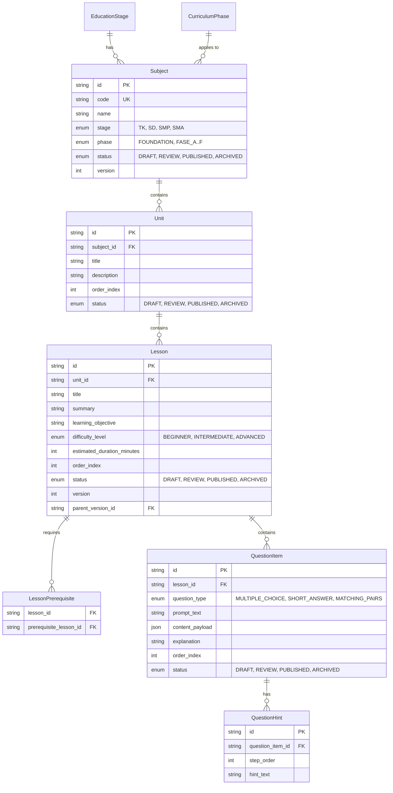

# Feature Specification: Model Konten Kurikulum Merdeka & Admin CMS AksiCendekia

**Feature Branch**: `003-content-curriculum-cms`

**Created**: 2026-08-27 | **Last Clarified**: 2026-08-27

**Status**: Clarified & Approved

**Input**: User description: "Model konten kurikulum dan admin CMS AksiCendekia. Hirarki konten: Jenjang → Fase Kurikulum Merdeka → Mata Pelajaran → Unit/Bab → Pelajaran → Butir Soal. Kebutuhan: 1. Skema data yang memetakan setiap pelajaran ke: jenjang, fase (A–F), mata pelajaran, capaian pembelajaran, tingkat kesulitan, perkiraan durasi. 2. Butir soal mendukung minimal tiga tipe: pilihan ganda, isian singkat dengan pencocokan jawaban yang toleran, dan mencocokkan pasangan. Setiap butir soal menyimpan pembahasan jawaban benar dan minimal satu petunjuk bertingkat. 3. Prasyarat antar-pelajaran: pelajaran dapat mensyaratkan penyelesaian pelajaran lain (mekanisme di balik status 'Terkunci' pada desain). 4. Alur status konten: DRAFT → REVIEW → PUBLISHED → ARCHIVED. Hanya PUBLISHED yang tersaji ke siswa. Perubahan pada konten PUBLISHED membuat versi baru, tidak menimpa. 5. Admin CMS untuk peran ADMIN: CRUD seluruh hirarki, editor butir soal dengan pratinjau, aksi ubah status, dan impor massal butir soal dari CSV. 6. API baca untuk siswa: daftar mata pelajaran per jenjang, daftar pelajaran per unit dengan status terkunci/terbuka, dan detail satu pelajaran. 7. Seed data: minimal satu mata pelajaran lengkap per jenjang SD, SMP, SMA dengan masing-masing 3 pelajaran berisi 10 butir soal, agar Feature 004 bisa diuji end-to-end. Di luar cakupan: mesin penyajian soal dan penilaian (Feature 004), gamifikasi, upload video, editor teks kaya berformat penuh, AI pembuat soal. Kriteria selesai: siswa tidak pernah menerima butir soal berstatus non-PUBLISHED melalui API mana pun; pelajaran dengan prasyarat belum terpenuhi mengembalikan status terkunci tanpa membocorkan isi soalnya; impor CSV 500 baris berhasil dengan laporan baris yang gagal."

---

## Executive Summary & Background Context

AksiCendekia adalah platform belajar bergamifikasi untuk siswa TK, SD, SMP, dan SMA. Agar penyajian materi dan soal pada Feature 004 (Mesin Penilaian & Penyajian Soal) dapat berjalan dengan lancar, platform memerlukan **Model Konten Kurikulum Merdeka yang Terstruktur** dan **Portal Admin Content Management System (CMS)** yang andal.

Fitur `003-content-curriculum-cms` mengimplementasikan hirarki lengkap data kurikulum Indonesia (Jenjang, Fase Kurikulum Merdeka, Mata Pelajaran, Unit/Bab, Pelajaran, dan Butir Soal), manajemen siklus hidup konten (`DRAFT` → `REVIEW` → `PUBLISHED` → `ARCHIVED`) dengan prinsip **immutable versioning**, penegakan prasyarat antar-pelajaran (*lesson dependencies*), editor butir soal interaktif dengan tiga tipe utama (Pilihan Ganda, Isian Singkat Toleran, dan Mencocokkan Pasangan) beserta petunjuk bertingkat dan pembahasan, mekanisme impor massal butir soal via CSV hingga 500 baris dengan error-reporting presisi per baris, API baca terisolasi untuk siswa yang menjamin zero-leakage konten non-PUBLISHED dan butir soal terkunci, serta pembenihan data (*seed data*) lengkap untuk jenjang SD, SMP, dan SMA.

Pengembangan fitur ini mematuhi penuh **Konstitusi AksiCendekia Prinsip VIII (Integritas Konten Kurikulum)**, **Prinsip II (Clean Architecture)**, **Prinsip IV (Keamanan & Validasi Zod)**, dan **Prinsip V/VI (Frontend Next.js App Router & Design System)**.

---

## Clarified Architectural Decisions

1. **Pemetaan Hirarki Kurikulum Merdeka**:
   - **Jenjang (`EducationStage`)**: `TK`, `SD`, `SMP`, `SMA`.
   - **Fase Kurikulum Merdeka (`CurriculumPhase`)**:
     - `PAUD`/`FOUNDATION`: TK
     - `FASE_A`: SD Kelas 1–2
     - `FASE_B`: SD Kelas 3–4
     - `FASE_C`: SD Kelas 5–6
     - `FASE_D`: SMP Kelas 7–9
     - `FASE_E`: SMA Kelas 10
     - `FASE_F`: SMA Kelas 11–12
   - Pemetaan ini disimpan secara eksplisit pada entitas `Lesson` dan `Subject` untuk mempermudah pencarian dan filter kurikulum.

2. **Immutable Content Versioning & Alur Status**:
   - Konten berstatus `PUBLISHED` bersifat **immutable** (tidak dapat diubah langsung secara *in-place*).
   - Ketika Admin mengedit entitas yang sudah `PUBLISHED`, sistem membuat draf revisi baru (`version` bertambah 1, terhubung melalui `parent_version_id`).
   - Konten `PUBLISHED` eksis dan tetap disajikan ke siswa sampai draf revisi baru disetujui (`REVIEW`) dan diterbitkan (`PUBLISHED`), di mana versi lama otomatis berubah status menjadi `ARCHIVED`.

3. **Pencocokan Toleran pada Isian Singkat (`SHORT_ANSWER`)**:
   - Menyimpan daftar jawaban yang diterima (`accepted_answers` array string) dan mode pencocokan (`matching_mode`: `EXACT`, `CASE_INSENSITIVE`, `NORMALIZED`).
   - Mode `NORMALIZED` secara otomatis memangkas spasi ganda, mengabaikan tanda baca periferal (titik/koma di akhir), mengabaikan huruf kapital/kecil, dan menormalisasi karakter diakritik.

4. **Penegakan Prasyarat & Penyembunyian Konten Terkunci**:
   - Sebuah pelajaran (`Lesson`) dapat mensyaratkan penyelesaian satu atau lebih pelajaran lain via tabel `LessonPrerequisite`.
   - Pada API siswa (`GET /api/v1/lessons/:id`), sistem memeriksa rekaman progress siswa. Jika prasyarat belum terpenuhi, API mengembalikan payload dengan `is_locked: true` dan **WAJIB membuang (strip/omit) seluruh array `butir_soal` dan kunci jawaban** dari respons JSON.

6. **Penegakan Arsitektur Anti-Cheat (Server-Side Evaluation, Idempotency, & Per-Session Rate Limit)**:
   - **Seluruh Penilaian & State di Server**: Klien/peramban (`apps/web`) bersifat *presentation-only*. Peramban TIDAK pernah menerima kunci jawaban atau skor terhitung. Seluruh kalkulasi nilai dan penilaian butir soal dilakukan secara eksklusif di server (`apps/api`).
   - **Idempotency Key pada Endpoint Submit**: Setiap pengiriman jawaban/submisi wajib menyertakan header `Idempotency-Key` (UUIDv4). Server menyimpan hasil submisi terproses. Jika key yang sama dikirim ulang (akibat lag atau percobaan ulangan ganda), server mengembalikan respons yang sudah ada tanpa memproses ulang atau memicu efek samping.
   - **Rate Limit Ketat Per Sesi**: Endpoint submisi dan penilaian dibatasi secara spesifik per sesi belajar/siswa (misal: maksimum 1 submisi per 2 detik per sesi), mencegah kecurangan melalui otomasi skrip bot atau serangan spamming payload.

---

## User Scenarios & Testing *(mandatory)*

### User Story 1 - Pemodelan Hirarki Kurikulum Merdeka & Versioning Immutable (Priority: P1)

Sebagai Content Manager / Admin CMS, saya ingin mengelola struktur kurikulum dari Jenjang, Fase (A–F), Mata Pelajaran, Unit/Bab, hingga Pelajaran dengan atribut Kurikulum Merdeka (Capaian Pembelajaran, Tingkat Kesulitan, Perkiraan Durasi), serta memperbarui konten terbitan secara versi baru (immutable versioning), agar materi pembelajaran terstruktur rapi dan tidak merusak pengalaman belajar siswa yang sedang aktif.

**Why this priority**: Merupakan fondasi data utama seluruh platform. Tanpa hirarki kurikulum dan alur status/versioning yang sah, soal tidak dapat dipetakan dan risiko kerusakan data terbitan sangat tinggi.

**Independent Test**:
1. Membuat entitas Mata Pelajaran, Unit, dan Pelajaran baru dengan status `DRAFT`.
2. Melakukan transisi status `DRAFT` → `REVIEW` → `PUBLISHED`.
3. Mengedit Pelajaran berstatus `PUBLISHED` menghasilkan entitas versi baru (`version: 2`, `status: DRAFT`, `parent_version_id: <id_v1>`), sementara versi 1 tetap berstatus `PUBLISHED`.
4. Menerbitkan versi 2 mengubah status versi 1 menjadi `ARCHIVED` dan versi 2 menjadi `PUBLISHED`.

**Acceptance Scenarios**:
1. **Given** Admin membuka formulir buat pelajaran, **When** mengisi judul, jenjang SD, fase FASE_B, capaian pembelajaran, tingkat kesulitan (BEGINNER/INTERMEDIATE/ADVANCED), dan durasi (menit), **Then** pelajaran berhasil dibuat dengan status `DRAFT` dan versi `1`.
2. **Given** pelajaran berstatus `PUBLISHED`, **When** Admin melakukan perubahan data, **Then** backend tidak menimpa record lama melainkan membuat clone record baru berstatus `DRAFT` dengan `version = version_lama + 1`.
3. **Given** draf versi baru diterbitkan (`PUBLISHED`), **When** transisi berhasil, **Then** record versi sebelumnya otomatis berganti status menjadi `ARCHIVED`.

---

### User Story 2 - Editor Butir Soal Rich (PG, Isian Singkat Toleran, Mencocokkan Pasangan) & Petunjuk Bertingkat (Priority: P1)

Sebagai Content Manager / Author Soal, saya ingin membuat dan mengedit butir soal dengan tiga tipe interaktif (Pilihan Ganda, Isian Singkat dengan pencocokan toleran, dan Mencocokkan Pasangan), melengkapinya dengan pembahasan jawaban benar dan minimal satu petunjuk bertingkat, serta melihat pratinjau interaktif real-time, agar kualitas soal terjamin sebelum diterbitkan.

**Why this priority**: Butir soal adalah inti dari materi uji siswa. Tipe soal yang bervariasi, petunjuk bertingkat, dan pembahasan sangat penting untuk Feature 004 dan efektivitas pembelajaran.

**Independent Test**:
1. Membuat soal Pilihan Ganda dengan 4 opsi dan 1 jawaban benar + petunjuk (minimal 1) + pembahasan.
2. Membuat soal Isian Singkat dengan mode pencocokan `NORMALIZED` (misal: "  jakarta " mencocokkan "Jakarta").
3. Membuat soal Mencocokkan Pasangan (misal: Istilah -> Definisi).
4. Pratinjau komponen di Admin CMS dapat me-render dan mensimulasikan ketiga tipe soal tersebut.

**Acceptance Scenarios**:
1. **Given** Admin memilih tipe `MULTIPLE_CHOICE`, **When** mengisi teks soal, 4 pilihan jawaban, menandai 1 opsi benar, 2 petunjuk bertingkat, dan 1 pembahasan, **Then** butir soal tersimpan dengan skema Zod valid.
2. **Given** Admin memilih tipe `SHORT_ANSWER`, **When** mengisi kunci jawaban "Pancasila" dengan mode `NORMALIZED`, **Then** sistem menyimpan aturan toleransi huruf kapital dan spasi.
3. **Given** Admin memilih tipe `MATCHING_PAIRS`, **When** menambahkan 3 pasang entitas kiri-kanan, **Then** sistem menyimpan pasangan kunci-nilai yang valid.
4. **Given** Admin menekan tombol "Pratinjau Soal", **When** modal pratinjau terbuka, **Then** UI me-render bentuk soal persis seperti yang akan dilihat siswa di Feature 004.

---

### User Story 3 - Prasyarat Pelajaran & Penegakan Status Terkunci Siswa (Priority: P1)

Sebagai Siswa, saya ingin melihat status pelajaran dalam suatu unit (Terkunci vs Terbuka) berdasarkan penyelesaian pelajaran prasyarat, agar jalur belajar saya terarah secara pedagogis dan konten yang belum saatnya diakses tidak teruji prematur.

**Why this priority**: Menjamin alur pembelajaran linier/terstruktur sesuai desain kurikulum AksiCendekia dan mencegah kebocoran soal pelajaran yang belum terbuka.

**Independent Test**:
1. Konfigurasi Pelajaran B mensyaratkan penyelesaian Pelajaran A (`LessonPrerequisite`).
2. Siswa X yang belum menyelesaikan Pelajaran A memanggil API `GET /api/v1/units/:unitId/lessons` -> Pelajaran B mengembalikan `is_locked: true`.
3. Memanggil API detail `GET /api/v1/lessons/:lessonBId` untuk Siswa X -> mengembalikan meta pelajaran dengan status `LOCKED` dan **TIDAK mengikutsertakan (0 item) `butir_soal`**.
4. Setelah Siswa X menandai Pelajaran A selesai (`COMPLETED`), Pelajaran B otomatis berstatus `is_locked: false` dan `butir_soal` dapat diakses.

**Acceptance Scenarios**:
1. **Given** Pelajaran 2 memiliki prasyarat Pelajaran 1, **When** siswa yang belum lulus Pelajaran 1 melihat daftar pelajaran, **Then** Pelajaran 2 menampilkan badge "Terkunci".
2. **Given** siswa mencoba memanggil endpoint detail Pelajaran 2 yang terkunci, **When** request diproses backend, **Then** backend mengembalikan metadata pelajaran tanpa menyertakan array `butir_soal` atau kunci jawaban.
3. **Given** siswa telah menyelesaikan Pelajaran 1, **When** memanggil endpoint detail Pelajaran 2, **Then** status menjadi terbuka (`is_locked: false`) dan butir soal disajikan.

---

### User Story 4 - Admin CMS Dashboard & Impor Massal Butir Soal via CSV (Priority: P2)

Sebagai Admin CMS, saya ingin mengelola seluruh konten melalui antarmuka Admin CMS (CRUD, filter status, aksi publikasi) dan melakukan impor massal butir soal dari file CSV (hingga 500 baris) dengan umpan balik laporan kesalahan yang jelas per baris, agar proses input soal skala besar dapat dilakukan dengan cepat dan efisien.

**Why this priority**: Mempercepat entri data kurikulum secara dramatis. Tanpa fitur impor massal CSV, pengisian ratusan soal untuk seed data dan operasional sekolah akan sangat lambat.

**Independent Test**:
1. Mengunggah file CSV berformat valid berisi 500 butir soal ke sebuah pelajaran.
2. Backend memproses file dalam transaksi batch dan berhasil mengimpor 500 soal.
3. Mengunggah file CSV berisi 500 baris di mana 3 baris memiliki format JSON hint corrupt -> Backend mengembalikan HTTP status 400/422 dengan payload detail kesalahan per baris: index baris, nama kolom, dan penyebab error.

**Acceptance Scenarios**:
1. **Given** Admin mengunggah file CSV 500 baris berformat valid, **When** tombol "Jalankan Impor" ditekan, **Then** sistem memasukkan 500 butir soal ke database dan menampilkan notifikasi sukses.
2. **Given** file CSV memiliki kesalahan pada baris 45 dan 112, **When** impor dijalankan, **Then** sistem menampilkan laporan error: "Baris 45: Kolom 'hints_json' format JSON tidak valid" dan "Baris 112: Kolom 'question_type' nilai tidak dikenali".

---

### User Story 5 - API Baca untuk Siswa & Proteksi Konten Non-PUBLISHED (Priority: P1)

Sebagai Siswa, saya ingin mengambil daftar mata pelajaran berdasarkan jenjang saya, daftar pelajaran dalam unit, dan detail pelajaran aktif, dengan jaminan bahwa saya hanya pernah menerima materi dan butir soal yang berstatus `PUBLISHED`.

**Why this priority**: NON-NEGOTIABLE Integritas Konten Kurikulum (Prinsip VIII Constitution). Konten berstatus `DRAFT`, `REVIEW`, atau `ARCHIVED` DILARANG keras bocor ke endpoint API siswa dalam kondisi apa pun.

**Independent Test**:
1. Buat butir soal A (`PUBLISHED`) dan butir soal B (`DRAFT`) pada Pelajaran X.
2. Panggil API siswa `GET /api/v1/lessons/:id`.
3. Verifikasi payload JSON: HANYA butir soal A yang dikembalikan. Butir soal B sama sekali tidak muncul dalam array.
4. Ubah status Pelajaran Y menjadi `DRAFT`. Panggil API siswa `GET /api/v1/subjects/:id` atau `GET /api/v1/lessons/:id` -> Pelajaran Y tidak ditemukan (404 Not Found) atau tidak muncul dalam daftar pelajaran siswa.

**Acceptance Scenarios**:
1. **Given** terdapat materi/soal berstatus `DRAFT` atau `REVIEW`, **When** siswa memanggil endpoint API baca apa pun, **Then** backend menyaring data tersebut sehingga tidak pernah terkirim ke klien siswa.
2. **Given** siswa memilih jenjang SMA, **When** memanggil `GET /api/v1/subjects?stage=SMA`, **Then** backend hanya mengembalikan mata pelajaran berstatus `PUBLISHED` yang relevan dengan jenjang SMA.

---

### User Story 6 - Seed Data Kompleks SD, SMP, SMA (Priority: P2)

Sebagai Pengembang / Tester Feature 004, saya ingin database terisi otomatis dengan seed data minimal 1 mata pelajaran lengkap per jenjang SD, SMP, dan SMA (masing-masing 3 pelajaran, total 9 pelajaran, masing-masing 10 butir soal = total 90 soal berstatus `PUBLISHED`), agar pengembangan Feature 004 (Mesin Penilaian) dapat diuji end-to-end secara langsung.

**Why this priority**: Memungkinkan testing integrasi dan verifikasi end-to-end tanpa memerlukan penginputan manual berulang-ulang via UI.

**Independent Test**:
1. Menjalankan perintah `pnpm seed` / `npx prisma db seed`.
2. Database terisi dengan:
   - SD: Matematika SD (3 Pelajaran x 10 Soal = 30 Soal PG, Short Answer, Matching Pairs)
   - SMP: IPA Terpadu SMP (3 Pelajaran x 10 Soal = 30 Soal)
   - SMA: Fisika SMA (3 Pelajaran x 10 Soal = 30 Soal)
3. Seluruh data seed berstatus `PUBLISHED` dan memenuhi syarat prasyarat.

**Acceptance Scenarios**:
1. **Given** perintah seed database dijalankan, **When** proses selesai, **Then** terdapat minimal 90 butir soal lengkap dengan pembahasan dan petunjuk bertingkat yang siap diuji di Feature 004.

---

## Edge Cases

1. **Siklus Dependensi Prasyarat (Circular Dependency)**:
   - *Kasus*: Admin mengonfigurasi Pelajaran A membutuhkan Pelajaran B, dan Pelajaran B membutuhkan Pelajaran A.
   - *Penanganan*: Service backend WAJIB melakukan validasi Directed Acyclic Graph (DAG) saat menyimpan prasyarat. Jika terdeteksi siklus, API mengembalikan HTTP 400 Bad Request: "Terdeteksi siklus prasyarat antar-pelajaran".

2. **Perubahan Status Pelajaran `PUBLISHED` ke `ARCHIVED` Saat Siswa Aktif**:
   - *Kasus*: Admin mengarsip pelajaran saat siswa sedang membuka detail pelajaran tersebut.
   - *Penanganan*: Klien siswa akan menerima respons gracefully (misal HTTP 404 saat mengajukan jawaban atau refresh) dan mengarahkan kembali ke daftar unit.

3. **File Impor CSV dengan Format Corrupt / Encoding Non-UTF-8**:
   - *Kasus*: File CSV diunggah menggunakan encoding Latin-1 atau Windows-1252 dengan pemisah titik koma `;`.
   - *Penanganan*: Parser CSV backend mendeteksi BOM / encoding, melakukan auto-conversion ke UTF-8, dan mendukung pemisah koma `,` maupun titik koma `;`. Jika struktur header tidak sesuai, impor dibatalkan sebelum transaksi database dimulai.

4. **Penghapusan Entitas Induk (Mata Pelajaran / Unit) yang Memiliki Konten Terbitan**:
   - *Kasus*: Admin mencoba menghapus Mata Pelajaran yang memuat Pelajaran berstatus `PUBLISHED`.
   - *Penanganan*: Soft delete / penolakan keras: Backend menolak penghapusan entitas induk jika masih memiliki turunan berstatus `PUBLISHED` (HTTP 409 Conflict). Admin harus mengarsip seluruh turunan terlebih dahulu.

---

## Requirements *(mandatory)*

### Functional Requirements

#### A. Skema Data & Hirarki Kurikulum
- **FR-001**: Sistem MUST mengimplementasikan hirarki data: Jenjang (`TK`, `SD`, `SMP`, `SMA`) → Fase Kurikulum Merdeka (`FOUNDATION`, `FASE_A`–`FASE_F`) → Mata Pelajaran → Unit/Bab → Pelajaran → Butir Soal.
- **FR-002**: Setiap Pelajaran MUST menyimpan metadata: Jenjang, Fase Kurikulum Merdeka, Mata Pelajaran, Capaian Pembelajaran (`learning_objective`), Tingkat Kesulitan (`BEGINNER`, `INTERMEDIATE`, `ADVANCED`), Perkiraan Durasi (dalam menit), dan Indeks Urutan (`order_index`).
- **FR-003**: Sistem MUST mendukung hubungan prasyarat antar-pelajaran (*many-to-many self-referential relation* pada `Lesson`).

#### B. Tipe Butir Soal & Media Pendukung
- **FR-004**: Sistem MUST mendukung minimal 3 tipe butir soal:
  1. `MULTIPLE_CHOICE` (Pilihan Ganda)
  2. `SHORT_ANSWER` (Isian Singkat)
  3. `MATCHING_PAIRS` (Mencocokkan Pasangan)
- **FR-005**: Setiap butir soal MUST menyimpan teks pembahasan jawaban benar (`explanation`).
- **FR-006**: Setiap butir soal MUST menyimpan minimal 1 petunjuk bertingkat (`hints` array terurut berdasarkan `step_order`).
- **FR-007**: Untuk tipe `SHORT_ANSWER`, sistem MUST menyimpan aturan pencocokan (`matching_mode`: `EXACT`, `CASE_INSENSITIVE`, `NORMALIZED`) dan daftar jawaban yang diterima.

#### C. Lifecycle Konten & Immutability Versioning
- **FR-008**: Sistem MUST menerapkan alur status konten: `DRAFT` → `REVIEW` → `PUBLISHED` → `ARCHIVED`.
- **FR-009**: Konten berstatus `PUBLISHED` bersifat *immutable*. Pengeditan konten `PUBLISHED` MUST menciptakan versi draf baru (`version = version + 1`, `parent_version_id`), tanpa mengubah atau menimpa konten terbitan yang sedang aktif.
- **FR-010**: Ketika draf versi baru diterbitkan (`PUBLISHED`), sistem MUST secara otomatis mengubah status versi lama menjadi `ARCHIVED`.

#### D. Admin CMS & Impor Massal CSV
- **FR-011**: Antarmuka Admin CMS (`apps/web`) MUST menyediakan fitur CRUD lengkap untuk seluruh level hirarki kurikulum khusus pengguna dengan peran `ADMIN`.
- **FR-012**: Admin CMS MUST menyediakan Editor Butir Soal interaktif dilengkapi komponen Pratinjau (*Real-time Preview*) untuk tipe soal PG, Isian Singkat, dan Mencocokkan Pasangan.
- **FR-013**: Admin CMS MUST menyediakan tombol aksi transisi status konten (`Kirim Review`, `Terbitkan`, `Arsipkan`, `Buat Draf Baru`).
- **FR-014**: Admin CMS MUST menyediakan fitur impor massal butir soal via CSV (kapasitas hingga 500 baris per file).
- **FR-015**: Fitur impor CSV MUST mendeteksi kesalahan per baris dan mengembalikan laporan error terstruktur (indeks baris, nama kolom, pesan error Zod).

#### E. API Baca Siswa & Keamanan Access Layer
- **FR-016**: API Siswa MUST menyediakan endpoint daftar mata pelajaran per jenjang (`GET /api/v1/subjects?stage={stage}`).
- **FR-017**: API Siswa MUST menyediakan endpoint daftar pelajaran per unit (`GET /api/v1/units/:unitId/lessons`) yang menyajikan atribut `is_locked` (boolean) berdasarkan progress prasyarat siswa.
- **FR-018**: API Siswa MUST menyediakan endpoint detail satu pelajaran (`GET /api/v1/lessons/:id`).
- **FR-019**: Jika suatu pelajaran berstatus terkunci (`is_locked: true`), API Siswa MUST TIDAK menyajikan (menyembunyikan/membuang) isi `butir_soal` dan kunci jawaban.
- **FR-020**: Seluruh endpoint API Siswa MUST HANYA mengembalikan konten berstatus `PUBLISHED`. Konten berstatus `DRAFT`, `REVIEW`, atau `ARCHIVED` MUST disaring (ditolak/tidak ditemukan).

#### F. Seed Data Kurikulum
- **FR-021**: Sistem MUST menyediakan skrip pembenihan data (*seed script*) yang mengisi database dengan minimal 1 mata pelajaran lengkap untuk jenjang SD, SMP, dan SMA.
- **FR-022**: Setiap mata pelajaran seed MUST memiliki minimal 3 pelajaran berurutan dengan prasyarat.
- **FR-023**: Setiap pelajaran seed MUST memuat 10 butir soal berstatus `PUBLISHED` (mengombinasikan PG, Isian Singkat, dan Mencocokkan Pasangan, dilengkapi petunjuk bertingkat dan pembahasan). Total minimal 90 butir soal seed.

---

### Key Entities

---

## Success Criteria *(mandatory)*

### Measurable Outcomes

- **SC-001 (Zero Non-Published Leakage)**: 100% permintaan API baca siswa yang meminta materi/butir soal terverifikasi bebas dari konten berstatus `DRAFT`, `REVIEW`, atau `ARCHIVED`.
- **SC-002 (Prerequisite Lock Security)**: Pelajaran berstatus terkunci (`is_locked: true`) 100% tidak membocorkan butir soal atau kunci jawaban pada payload API detail pelajaran.
- **SC-003 (Impor Massal CSV Performance & Precision)**: Impor CSV 500 baris butir soal selesai diproses dalam waktu kurang dari 5 detik, serta mengembalikan laporan rincian baris gagal secara presisi jika terdapat kesalahan format.
- **SC-004 (Immutable Versioning Integrity)**: Perubahan pada entitas `PUBLISHED` 100% menghasilkan draf versi baru tanpa menimpa data terbitan aktif.
- **SC-005 (Coverage Seed Data)**: Menjalankan skrip seed menghasilkan tepat minimal 90 butir soal `PUBLISHED` mencakup SD, SMP, SMA yang siap dikonsumsi oleh Feature 004.
- **SC-006 (Test Coverage Gate)**: Seluruh modul service, controller, dan helper validasi Zod mencapai cakupan tes otomatis minimal **80%** (Sesuai Prinsip III Constitution).

---

## Assumptions & Scope Boundaries

### Assumptions
- Otentikasi dan otorisasi peran (`ADMIN` vs `SISWA`) menggunakan infrastruktur JWT dan Relational Auth Middleware dari Feature 002 (`002-auth-multi-role`).
- Penyimpanan progress belajar siswa (`StudentLessonProgress`) untuk mengecek prasyarat disimulasikan/disediakan pada modul progress baca.

### Out of Scope (Di Luar Cakupan)
- Mesin penyajian soal interaktif dan kalkulasi skor/jawaban siswa (Cakupan Feature 004).
- Elemen gamifikasi seperti XP, koin, streek, dan papan peringkat (Cakupan Feature 005+).
- Pengunggahan dan hosting video/media berat (Materi berupa teks + gambar dasar self-hosted).
- Editor teks kaya berformat WYSIWYG kompleks (Gunakan Markdown dasar / plain text).
- AI pembuat soal otomatis (*AI Question Generator*).
