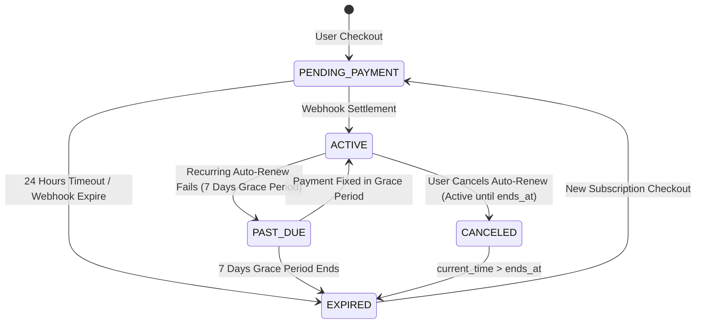

# Architectural Research & Design Decisions: Model Freemium dan Langganan Pro AksiCendekia

**Feature Branch**: `008-freemium-pro-subscription`
**Spec**: [spec.md](file:///d:/Source%20Code/Personal/aksicendekia/specs/008-freemium-pro-subscription/spec.md)

---

## 1. Centralized Entitlement Layer (`EntitlementService`) & Anti-Bypass Architecture

### Context
Untuk mencegah eksploitasi kuota client-side atau percabangan `if (user.isPro)` yang tersebar di seluruh modul backend (Learning Engine, Gamification, Parent Dashboard), sistem membutuhkan **Layer Entitlement Terpusat (`EntitlementService`)**.

### Options Evaluated
1. **Option A: Direct Field Check pada User / Subscription Table**
   - Setiap service mengeksekusi `prisma.subscription.findFirst({ where: { userId, status: 'ACTIVE' } })`.
   - *Pros*: Sederhana untuk prototipe awal.
   - *Cons*: Melanggar Prinsip Clean Architecture & DRY. Mengakibatkan logika bisnis langganan tersebar, rentan bug saat penambahan jenis entitlement baru, dan tidak mendukung pewarisan Paket Keluarga secara konsisten.
2. **Option B: Centralized Entitlement Engine dengan Real-Time Inheritance Lookup (Chosen)**
   - Satu-satunya service yang mengevaluasi kuota adalah `EntitlementService`.
   - Fitur modul lain memanggil `EntitlementService.checkQuotaAccess(userId, entitlementKey)` atau `EntitlementService.getUserEntitlements(userId)`.
   - Evaluasi mencakup pencarian langganan langsung pengguna -> pencarian pewarisan Paket Keluarga Orang Tua (via `ParentChildLink`) -> pembacaan konfigurasi `PlanEntitlementConfig` -> penghitungan penggunaan harian berbasis zona waktu lokal pengguna (`timezone`).
   - *Pros*: Keamanan terjamin, terpusat, mematuhi UU PDP & Konstitusi AksiCendekia, dan mudah di-maintain.
   - *Cons*: Membutuhkan abstraksi interface yang rapi pada backend.

### Decision
Memilih **Option B**.

---

## 2. Indonesian Payment Gateway Webhook Security & Idempotency Engine

### Context
Integrasi Payment Gateway Indonesia (seperti Midtrans Snap atau Xendit) mengirimkan konfirmasi transaksi melalui HTTP Webhook POST. Webhook dapat mengalami kegagalan jaringan, dikirimkan berulang (*retries*), atau menjadi target manipulasi serangan *replay attack*.

### Mitigation Strategy
1. **Signature Verification (Kriptografi SHA-512 / HMAC)**:
   - Webhook payload WAJIB memverifikasi header/field `signature_key`.
   - Formula Verifikasi: `SHA512(order_id + status_code + gross_amount + PAYMENT_GATEWAY_SERVER_KEY)`.
   - Jika `signature_key` tidak cocok, request langsung ditolak dengan HTTP 401 `INVALID_WEBHOOK_SIGNATURE`.
2. **Idempotency Locking (DB Ledger Level)**:
   - Setiap transaksi memiliki status di `PaymentTransaction`.
   - Ketika webhook diterima:
     ```typescript
     const tx = await prisma.paymentTransaction.findUnique({ where: { orderId } });
     if (tx.status === 'SETTLED') {
       // Webhook sudah pernah diproses sebelumnya. Return 200 OK secara idempoten tanpa memperpanjang langganan lagi.
       return reply.status(200).send({ status: 'OK', message: 'Transaction already settled' });
     }
     ```
3. **Zero Credential Hardcoding**:
   - `PAYMENT_GATEWAY_SERVER_KEY`, `PAYMENT_GATEWAY_CLIENT_KEY`, dan `PAYMENT_GATEWAY_WEBHOOK_SECRET` divalidasi via **Zod env schema** pada saat startup server.

---

## 3. Prorated Credit Calculation Engine for Mid-Cycle Upgrades

### Context
Pengguna yang berlangganan `PRO_PERSONAL` dan ingin berpindah ke `PRO_FAMILY` di pertengahan bulan berhak mendapatkan pemotongan harga berdasarkan sisa hari langganan lama yang belum terpakai (*prorated credit*).

### Formula
$$\text{Unused Days} = \text{MAX}\left(0, \frac{\text{ends\_at} - \text{NOW()}}{86400}\right)$$
$$\text{Daily Rate} = \frac{\text{Previous Plan Price}}{\text{Total Days Period}}$$
$$\text{Prorated Credit} = \text{ROUND}(\text{Unused Days} \times \text{Daily Rate})$$
$$\text{Net Amount Due} = \text{MAX}(0, \text{New Plan Price} - \text{Prorated Credit})$$

Perhitungan ini diproses secara otomatis saat endpoint `POST /api/v1/subscriptions/checkout` dipanggil untuk upgrade paket.

---

## 4. Subscription Lifecycle & Real-Time Expiration Cutoff

### Lifecycle State Machine


### Real-Time Expiration Determination Logic
Saat `EntitlementService` mengevaluasi status langganan pengguna:
```typescript
function isSubscriptionValid(sub: Subscription, currentTime: Date): boolean {
  if (sub.status === 'ACTIVE' || sub.status === 'CANCELED') {
    return currentTime <= sub.endsAt;
  }
  if (sub.status === 'PAST_DUE') {
    return sub.gracePeriodEndsAt !== null && currentTime <= sub.gracePeriodEndsAt;
  }
  return false;
}
```
Logika ini memastikan bahwa saat `currentTime > endsAt` (atau `gracePeriodEndsAt`), sistem secara real-time langsung memberlakukan tier `FREE` tanpa membutuhkan *cron job* khusus.

---

## 5. Family Subscription Inheritance Logic

### Retrieval Workflow
1. `EntitlementService` menerima request `userId`.
2. Evaluasi 1: Cari `Subscription` milik `userId` langsung. Jika `isSubscriptionValid() == true`, kembalikan entitlement paket pengguna.
3. Evaluasi 2: Jika pengguna adalah `STUDENT`, cari `ParentChildLink` berstatus `ACTIVE` yang terhubung ke `parentUserId`.
4. Jika `parentUserId` ditemukan, cari `Subscription` milik orang tua dengan `planCode == 'PRO_FAMILY'`. Jika valid (`ACTIVE` atau `PAST_DUE`), kembalikan entitlement `PRO` lengkap dengan `source = 'INHERITED_PARENT'`.
5. Evaluasi 3: Jika tidak ada langganan yang valid, kembalikan entitlement tier `FREE` (`source = 'DEFAULT_FREE'`).

---
